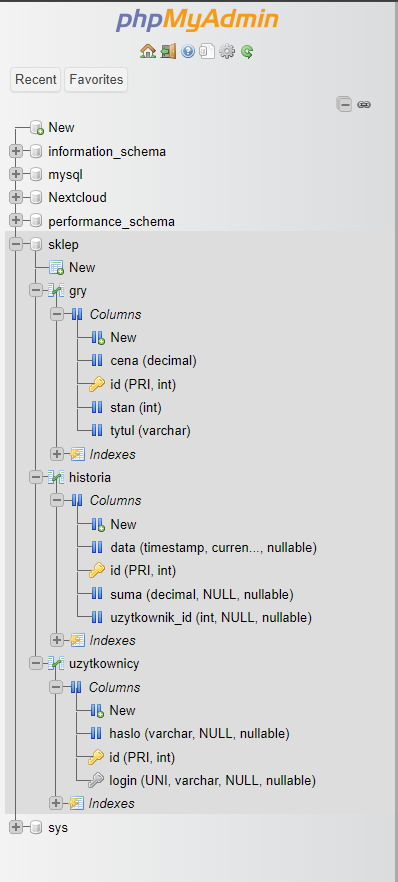
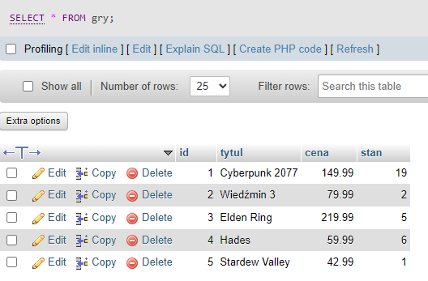
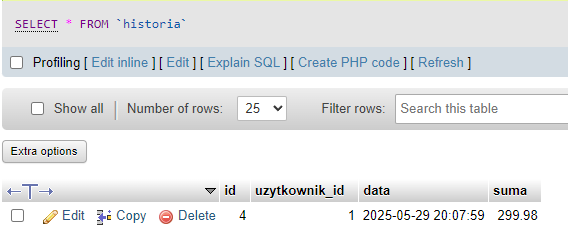
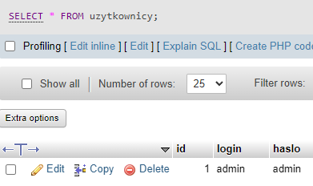
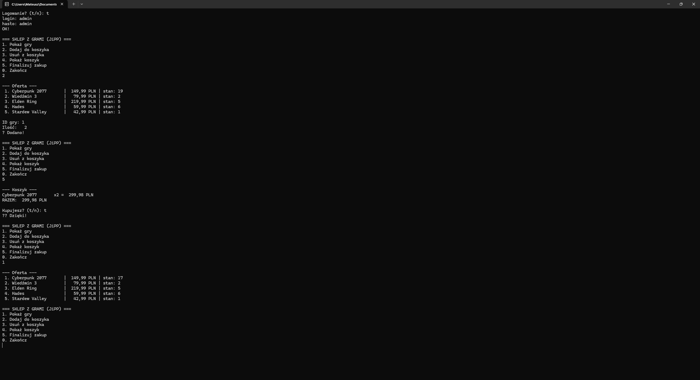

# jipp-test

##Struktura bazy danych

gry   (id, tytul, cena, stan)
uzytkownicy   (id, login, haslo)
historia   (id, uzytkownik_id, data, suma)

Plik sql/setup.sql zawiera skrypt tworz¹cy powy¿sze tabele oraz dane startowe.

##Zrzuty ekranu

### Struktura bazy danych

### Tabela gier

### Tabela historii

### Tabela u¿ytkowników

### Dzia³anie programu
